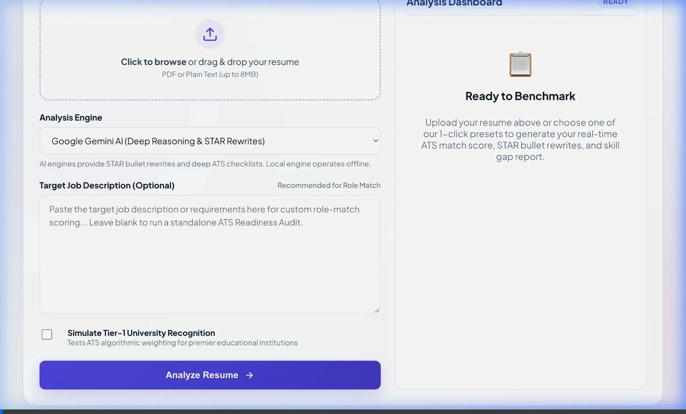

# ResumeIQ — AI Resume Analyzer & ATS Optimization Engine

[](https://nodejs.org)
[](https://python.org)
[](Dockerfile)
[](https://ai.google.dev/)
[](https://groq.com)
[](LICENSE)

> 🚀 **Live Demo:** [https://contains-speakers-technique-dishes.trycloudflare.com](https://contains-speakers-technique-dishes.trycloudflare.com)

An intelligent, full-stack AI Resume Analyzer and ATS Optimization platform. Benchmark candidate resumes against target job descriptions with deep LLM evaluation, STAR-method bullet rewrites, automated ATS compliance audits, and skill gap detection.

---

## 🎬 Demo Overview



---

## 🚀 Key Features

* **⚡ 1-Click Demo Presets**:
  * Instantly load and test real-world candidate profiles with matching job descriptions:
    * **💻 Full-Stack Engineer** (React, TypeScript, Node.js, PostgreSQL, AWS)
    * **📊 Data Scientist / ML** (Python, Scikit-Learn, PyTorch, SQL, Spark)
    * **☁️ Cloud & DevOps** (Kubernetes, Terraform, Docker, CI/CD, AWS)
* **★ AI Bullet Point Optimizer (STAR Framework)**:
  * Automatically scans resume bullet points and upgrades passive descriptions into high-impact accomplishment statements (*Strong Action Verb + Context/Tool + Measurable Metric/Result*).
  * 1-Click **Copy** button with animated clipboard feedback.
* **✍️ Interactive Live Bullet Improver**:
  * An embedded real-time tool: paste any sentence from your resume to receive dual variations:
    1. **Metric-Driven Variation** (percentage gains, latency reduction, user scale).
    2. **Technical Leadership Variation** (architectural ownership, tooling, team collaboration).
* **📋 Automated ATS Compliance Audit**:
  * Audits 6 critical ATS dimensions with `PASS` or `ACTION` tags:
    * Contact Details (Email & Phone detection)
    * Professional Profiles (LinkedIn, GitHub)
    * Standard Resume Headings (Experience, Skills, Projects, Education)
    * Measurable Impact & Metrics
    * Action-Oriented Verbs
    * ATS Word Count & Density
* **🛡️ Resilient Dual-Engine Architecture**:
  * **Online Mode**: Deep reasoning powered by **Google Gemini 2.5 Flash** or **Groq LLaMA-3**.
  * **Offline Mode**: 100% local heuristic analysis powered by pure-Python NLP (TF-IDF cosine similarity, section weighting, and keyword coverage) with zero runtime warnings.
  * **Graceful Fallbacks**: If API keys are missing or reach quotas, the system automatically falls back to local scoring with a clear user notice.
* **📄 Print & PDF Export**:
  * Built-in clean executive report layout ready for 1-click printing or PDF export.

---

## 🛠️ Tech Stack

* **Frontend**: HTML5, Vanilla CSS3 (Custom Glassmorphism, Modern Design Tokens, Plus Jakarta Sans typography), Vanilla JavaScript (ES6+).
* **Backend**: Node.js HTTP Server.
* **AI & LLM Services**: Google Gemini API (`gemini-2.5-flash`), Groq API (`llama-3.1-8b-instant`).
* **Document Parsing**: `pdf-parse` (PDF text extraction), Plain Text decoder.
* **Local NLP Engine**: Python 3 (Pure Python Tokenization, Stemming, and TF-IDF Cosine Similarity).

---

## 📁 Project Structure

```text
.
├── assets/
│   └── demo.webp              # Animated visual walkthrough
├── public/
│   ├── analysis-renderer.js   # UI components (STAR cards, ATS checklist, copy buttons)
│   ├── app.js                 # Presets, stepper animation, seamless in-page rendering
│   ├── index.html             # Main application dashboard
│   ├── result.html            # Standalone dedicated report view
│   ├── result.js              # Standalone view controller & storage sync
│   └── style.css              # Modern design tokens, glassmorphism, responsive grid
├── scripts/
│   └── analyze_resume.py      # Pure Python NLP engine & ATS audit generator
├── server.js                  # Node.js backend server & API routing
├── package.json
└── .env.example
```

---

## ⚡ Quick Start

### 1. Prerequisites
* **Node.js**: v18 or higher
* **Python**: 3.10 or higher

### 2. Installation
```bash
# Clone the repository
git clone https://github.com/anand15-og/ResumeIQ.git
cd ResumeIQ

# Install dependencies
npm install
```

### 3. Environment Configuration
Create a `.env` file from the template:
```bash
cp .env.example .env
```

Configure your environment variables:
```env
PORT=3000
RESUME_ANALYZER_PYTHON=python3

# Optional: Add your keys for AI-powered analysis
GEMINI_API_KEY=your_gemini_api_key_here
GEMINI_MODEL=gemini-2.5-flash

GROQ_API_KEY=your_groq_api_key_here
GROQ_MODEL=llama-3.1-8b-instant
```
> **Note**: If no API keys are provided, the app runs in **Local Keyword Engine** mode completely offline without any errors.

### 4. Start the Application
You can run locally with Node.js or with Docker:

**Option A: Local Node.js**
```bash
npm start
```

**Option B: Docker Compose (1 Command)**
```bash
docker compose up --build
```

Then open:
```text
http://localhost:3000
```

---

## 📡 API Reference

### `POST /api/analyze`
Submits a resume file and optional job description for full ATS scoring and STAR optimization.

**Request Body**:
```json
{
  "resumeFile": {
    "name": "resume.pdf",
    "type": "application/pdf",
    "size": 102400,
    "contentBase64": "..."
  },
  "jobDescription": "Looking for a Full-Stack Engineer...",
  "analysisMode": "gemini",
  "enableTier1Booster": false
}
```

### `POST /api/rewrite-bullet`
Rewrites an individual resume line into metric-driven and technical leadership variations.

**Request Body**:
```json
{
  "bulletText": "Worked on database optimization and fixed backend bugs."
}
```

### `GET /api/status`
Returns runtime health and active AI engine availability.

---

## Author

Anand

---

## 📄 License

This project is licensed under the [MIT License](LICENSE).
